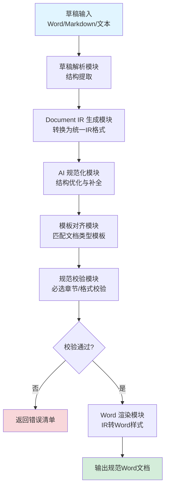
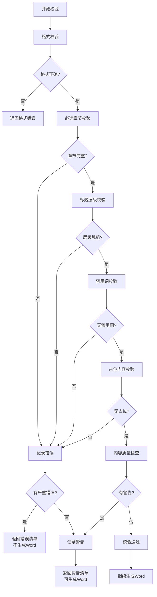
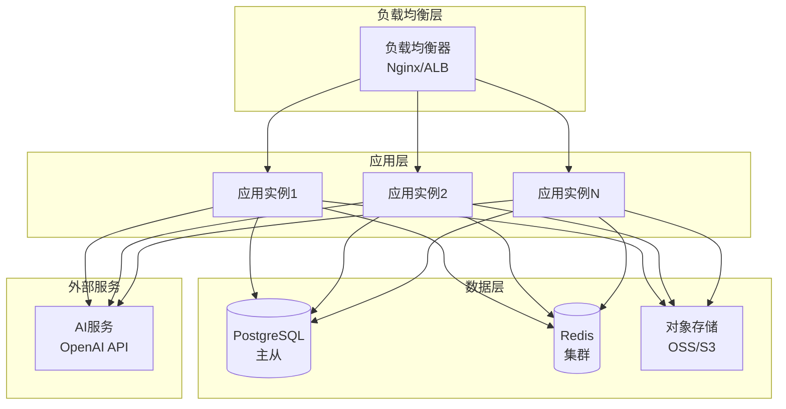

# 需求文档｜草稿自动生成规范 Word 文档系统
**面向对象：产品经理 / 研发工程师**

---

## 1. 背景说明

在公司日常工作中，存在大量由不同角色产出的文档草稿（如公告、技术方案、API 说明等）。这些草稿普遍存在：

- 结构不统一（章节缺失、顺序混乱）
- 格式不规范（标题、正文、表格样式不一致）
- 高度依赖人工整理与排版
- 难以复用模板与规范，无法规模化

为提升文档生产效率与一致性，有必要建设一套 **“草稿 → 规范 Word 文档”** 的自动化系统。

---

## 2. 建设目标

### 2.1 核心目标

- 支持输入非规范草稿（Word / Markdown / 文本）
- 自动生成结构清晰、格式统一的 Word 文档
- 文档格式严格遵循公司模板
- 降低人工排版与反复修改成本

### 2.2 设计原则

- **结构与样式解耦**：AI 不直接生成 Word 排版
- **中间表示（Document IR）驱动**：所有文档处理基于 IR
- **模板化、可校验、可复现**
- **面向扩展**：支持新增文档类型与输出形式

---

## 3. 使用场景

- 对外公告 / 新闻稿
- 技术方案说明
- API 对接文档
- 公司大事记 / 内部总结材料

---

## 4. 总体方案

### 4.1 系统流程



**流程说明：**
1. **草稿输入**：支持多种格式（`.docx`、`.md`、纯文本）
2. **草稿解析**：提取文档结构（标题、段落、列表、表格等）
3. **IR 生成**：将解析结果转换为统一的 Document IR 格式
4. **AI 规范化**：识别疑似标题、补全缺失章节、优化结构
5. **模板对齐**：根据文档类型匹配对应模板
6. **规范校验**：检查必选章节、标题层级、禁用词等
7. **Word 渲染**：将 IR 映射为 Word 样式，生成最终文档

### 4.2 核心模块

1. 草稿解析模块  
2. Document IR 生成模块  
3. AI 规范化模块  
4. 模板与校验模块  
5. Word 渲染模块  

---

## 4.3 技术选型建议

### 4.3.1 后端框架

**推荐方案：**
- **Python + FastAPI**：适合快速开发，异步处理能力强，生态丰富
- **备选：Java + Spring Boot**：企业级应用，稳定性高，但开发周期较长

**选择理由：**
- Python 在文档处理和 AI 集成方面有丰富库支持
- FastAPI 提供自动 API 文档生成，便于接口调试
- 异步特性适合处理耗时较长的文档生成任务

### 4.3.2 Word 处理库

**推荐方案：**
- **python-docx**：Python 生态中最成熟的 Word 处理库
  - 支持读取和生成 `.docx` 文件
  - 可操作样式、段落、表格等元素
  - 文档完善，社区活跃

**备选方案：**
- **docx4j**（Java）：功能强大，但学习曲线较陡
- **mammoth.js**（Node.js）：适合简单转换场景

### 4.3.3 Markdown 解析库

**推荐方案：**
- **markdown**（Python）：标准 Markdown 解析
- **markdown-it-py**：支持 CommonMark 规范，扩展性强
- **pandoc**：支持多种格式转换，功能全面但较重

### 4.3.4 AI 服务集成

**推荐方案：**
- **OpenAI API**：GPT-4 / GPT-3.5-turbo
  - 文本理解能力强
  - API 稳定可靠
  - 支持结构化输出（JSON mode）

**备选方案：**
- **本地模型**：Llama 2 / ChatGLM（需考虑部署成本）
- **其他云服务**：Claude API、文心一言等

**集成要求：**
- 支持流式输出（Streaming）
- 支持函数调用（Function Calling）用于结构化输出
- 具备重试机制和错误处理

### 4.3.5 存储方案

**文件存储：**
- **对象存储**：OSS / S3 / MinIO
  - 存储上传的草稿文件
  - 存储生成的 Word 文档
  - 支持临时文件清理策略

**元数据存储：**
- **关系型数据库**：PostgreSQL / MySQL
  - 存储任务状态、模板配置、校验规则
  - 支持事务和复杂查询

**缓存：**
- **Redis**：缓存模板配置、校验规则，提升响应速度

### 4.3.6 部署方案

**容器化部署：**
- **Docker**：应用容器化
- **Docker Compose**：本地开发环境
- **Kubernetes**：生产环境（可选）

**服务架构：**
- **单体应用**（初期）：快速迭代，降低复杂度
- **微服务**（后期）：按需拆分（解析服务、AI 服务、渲染服务）

### 4.3.7 其他依赖

- **JSON Schema 验证**：`jsonschema`（Python）用于 IR Schema 校验
- **文件类型检测**：`python-magic` 或 `filetype`
- **日志框架**：`loguru` 或 `structlog`
- **配置管理**：`pydantic-settings` 或 `python-decouple`
- **任务队列**（可选）：`Celery` + `Redis` 用于异步任务处理

---

## 5. Document IR 需求

### 5.1 定义

Document IR（Intermediate Representation）是系统内部使用的统一文档结构描述，用于承载：

- 文档元信息（类型、受众、语气等）
- 文档结构（标题、段落、列表、表格等）
- 纯内容数据（不包含排版细节）

### 5.2 IR 基本结构示例

```json
{
  "meta": {
    "title": "示例文档",
    "docType": "announcement",
    "audience": "external",
    "tone": "formal",
    "version": "1.0"
  },
  "body": [
    { "type": "heading", "level": 1, "text": "背景" },
    { "type": "paragraph", "text": "正文内容" }
  ]
}
```

### 5.3 支持的 Block 类型

- heading（level 1–4）
- paragraph
- list（有序 / 无序）
- table
- image
- code
- callout（info / warning / note）

### 5.4 Document IR 完整 Schema 定义

#### 5.4.1 根结构

```json
{
  "$schema": "http://json-schema.org/draft-07/schema#",
  "type": "object",
  "required": ["meta", "body"],
  "properties": {
    "meta": { "$ref": "#/definitions/Meta" },
    "body": {
      "type": "array",
      "items": { "$ref": "#/definitions/Block" },
      "minItems": 1
    }
  }
}
```

#### 5.4.2 Meta 元信息结构

```json
{
  "meta": {
    "title": "string (required, max 200 chars)",
    "docType": "enum: announcement | technical | api | summary (required)",
    "audience": "enum: internal | external (required)",
    "tone": "enum: formal | casual | neutral (required, default: formal)",
    "version": "string (optional, default: 1.0)",
    "author": "string (optional)",
    "createdAt": "string ISO 8601 (optional)",
    "tags": ["string"] (optional)
  }
}
```

#### 5.4.3 Block 类型详细定义

**1. Heading（标题）**

```json
{
  "type": "heading",
  "level": 1 | 2 | 3 | 4,
  "text": "string (required, max 500 chars)",
  "id": "string (optional, for anchor)"
}
```

**2. Paragraph（段落）**

```json
{
  "type": "paragraph",
  "text": "string (required)",
  "style": "enum: normal | quote | emphasis (optional, default: normal)"
}
```

**3. List（列表）**

```json
{
  "type": "list",
  "ordered": "boolean (required)",
  "items": [
    {
      "text": "string (required)",
      "level": "number (optional, default: 0, for nested lists)"
    }
  ],
  "minItems": 1
}
```

**4. Table（表格）**

```json
{
  "type": "table",
  "header": ["string"] (optional),
  "rows": [
    ["string"] (required, length must match header if present)
  ],
  "caption": "string (optional)",
  "alignment": "enum: left | center | right (optional, default: left)"
}
```

**5. Image（图片）**

```json
{
  "type": "image",
  "src": "string (required, URL or file path)",
  "alt": "string (optional)",
  "caption": "string (optional)",
  "width": "number (optional, pixels)",
  "height": "number (optional, pixels)"
}
```

**6. Code（代码块）**

```json
{
  "type": "code",
  "code": "string (required)",
  "language": "string (optional, e.g., python, javascript)",
  "filename": "string (optional)"
}
```

**7. Callout（提示框）**

```json
{
  "type": "callout",
  "variant": "enum: info | warning | note | error (required)",
  "title": "string (optional)",
  "content": "string (required)"
}
```

#### 5.4.4 完整示例

```json
{
  "meta": {
    "title": "API 对接文档",
    "docType": "api",
    "audience": "external",
    "tone": "formal",
    "version": "1.0",
    "author": "技术团队",
    "createdAt": "2024-01-15T10:00:00Z"
  },
  "body": [
    {
      "type": "heading",
      "level": 1,
      "text": "概述",
      "id": "overview"
    },
    {
      "type": "paragraph",
      "text": "本文档描述了 API 接口的使用方法和注意事项。"
    },
    {
      "type": "heading",
      "level": 2,
      "text": "接口列表"
    },
    {
      "type": "table",
      "header": ["接口名称", "方法", "路径", "说明"],
      "rows": [
        ["获取用户信息", "GET", "/api/users/{id}", "根据ID获取用户详情"],
        ["创建用户", "POST", "/api/users", "创建新用户"]
      ],
      "caption": "API 接口列表"
    },
    {
      "type": "callout",
      "variant": "warning",
      "title": "注意事项",
      "content": "所有接口都需要进行身份认证，请在请求头中携带 Token。"
    },
    {
      "type": "heading",
      "level": 2,
      "text": "请求示例"
    },
    {
      "type": "code",
      "language": "python",
      "code": "import requests\n\nresponse = requests.get(\n    'https://api.example.com/users/123',\n    headers={'Authorization': 'Bearer YOUR_TOKEN'}\n)\nprint(response.json())"
    }
  ]
}
```

#### 5.4.5 Schema 版本管理

- IR Schema 采用语义化版本（Semantic Versioning）
- 当前版本：`v1.0.0`
- 向后兼容的修改（如新增可选字段）使用 `MINOR` 版本号
- 不兼容的修改（如删除字段、修改类型）使用 `MAJOR` 版本号
- 每个 IR 文档必须包含 `meta.version` 字段，用于标识使用的 Schema 版本

---

## 6. 功能需求

### 6.1 草稿解析

- 支持解析 `.docx` / `.md` / 文本输入
- 提取段落、标题、列表、表格、图片
- 保留原始内容顺序

### 6.2 Word → Document IR 映射

- 基于 Word 样式规则映射 IR block
- 明确结构不使用 AI 推断
- 对不确定结构进行标记

### 6.3 AI 规范化处理

AI 仅在以下场景介入：

- 识别“疑似标题”的正文段落
- 识别语义提示（如“注意：”“说明：”）
- 发现缺失章节并插入占位
- 优化章节顺序建议

AI 不得：

- 改写事实性内容
- 生成原文不存在的信息
- 直接控制 Word 样式

### 6.4 模板对齐

#### 6.4.1 模板概述

不同文档类型对应不同模板，模板定义了文档的结构规范、样式映射和校验规则。

#### 6.4.2 模板存储结构

模板采用 JSON 格式存储，结构如下：

```json
{
  "templateId": "announcement-v1",
  "name": "对外公告模板",
  "docType": "announcement",
  "version": "1.0.0",
  "description": "用于生成对外公告的标准模板",
  "requiredSections": [
    {
      "id": "title",
      "name": "标题",
      "type": "heading",
      "level": 1,
      "required": true
    },
    {
      "id": "background",
      "name": "背景",
      "type": "heading",
      "level": 1,
      "required": true
    },
    {
      "id": "content",
      "name": "正文内容",
      "type": "heading",
      "level": 1,
      "required": true
    }
  ],
  "sectionOrder": ["title", "background", "content", "contact"],
  "tone": "formal",
  "styleMapping": {
    "heading.1": "Title",
    "heading.2": "Heading 1",
    "paragraph": "Normal",
    "list": "List Paragraph"
  },
  "wordTemplatePath": "/templates/announcement.docx"
}
```

#### 6.4.3 模板配置格式

**模板字段说明：**

| 字段 | 类型 | 必填 | 说明 |
|------|------|------|------|
| `templateId` | string | 是 | 模板唯一标识符 |
| `name` | string | 是 | 模板显示名称 |
| `docType` | enum | 是 | 文档类型（announcement/technical/api/summary） |
| `version` | string | 是 | 模板版本号 |
| `requiredSections` | array | 是 | 必选章节列表 |
| `sectionOrder` | array | 否 | 章节顺序（如不指定，按 IR 中顺序） |
| `tone` | enum | 否 | 语气要求（formal/casual/neutral） |
| `styleMapping` | object | 是 | IR Block 到 Word 样式的映射 |
| `wordTemplatePath` | string | 是 | Word 模板文件路径 |

**必选章节结构：**

```json
{
  "id": "string (required, unique)",
  "name": "string (required, display name)",
  "type": "enum: heading | paragraph | list (required)",
  "level": "number (required if type=heading, 1-4)",
  "required": "boolean (required)",
  "placeholder": "string (optional, 缺失时的占位文本)"
}
```

#### 6.4.4 模板与 IR 的映射规则

**1. 章节匹配规则：**
- 通过 `heading.text` 与 `requiredSections.name` 进行模糊匹配
- 支持同义词匹配（如"概述"匹配"背景"）
- 匹配失败时，AI 模块介入识别

**2. 样式映射规则：**
- `styleMapping` 定义了 IR Block 类型到 Word 样式的映射
- 支持层级映射（如 `heading.1` → `Title`，`heading.2` → `Heading 1`）
- 未定义的 Block 类型使用默认样式

**3. 章节顺序对齐：**
- 如果模板定义了 `sectionOrder`，系统会按照该顺序重新排列 IR 中的章节
- 缺失的必选章节会在对应位置插入占位内容
- 多余的章节会保留在文档末尾

#### 6.4.5 模板版本管理

- 模板采用语义化版本控制
- 支持模板继承：新版本可以继承旧版本的配置
- 模板变更历史记录在数据库中
- 生成文档时记录使用的模板版本，确保可追溯

**模板继承示例：**

```json
{
  "templateId": "announcement-v2",
  "extends": "announcement-v1",
  "version": "2.0.0",
  "changes": {
    "addedSections": ["footer"],
    "modifiedSections": ["contact"],
    "removedSections": []
  }
}
```

#### 6.4.6 模板扩展机制

- 支持自定义模板：用户可以上传自定义 Word 模板文件和配置
- 支持模板组合：复杂文档可以组合多个基础模板
- 支持条件章节：根据文档元信息动态决定是否包含某些章节

**条件章节示例：**

```json
{
  "id": "technical-details",
  "name": "技术细节",
  "type": "heading",
  "level": 1,
  "required": false,
  "condition": {
    "field": "meta.docType",
    "operator": "equals",
    "value": "technical"
  }
}
```

#### 6.4.7 预定义模板类型

系统内置以下模板类型：

1. **announcement（公告模板）**
   - 必选章节：标题、背景、正文、联系方式
   - 语气：正式
   - 适用场景：对外公告、新闻稿

2. **technical（技术方案模板）**
   - 必选章节：概述、技术架构、实施方案、风险评估
   - 语气：正式
   - 适用场景：技术方案说明

3. **api（API 文档模板）**
   - 必选章节：概述、接口列表、请求示例、响应说明
   - 语气：正式
   - 适用场景：API 对接文档

4. **summary（总结材料模板）**
   - 必选章节：标题、时间范围、主要内容、总结
   - 语气：中性
   - 适用场景：公司大事记、内部总结

### 6.5 规范校验

#### 6.5.1 校验类型

**1. 必选章节校验**
- 检查模板中定义的必选章节是否都存在
- 支持模糊匹配和同义词识别
- 缺失章节会在错误清单中标注

**2. 标题层级校验**
- 检查标题层级是否符合规范（1→2→3→4，不允许跳级）
- 检查是否以一级标题开始
- 检查标题层级深度不超过 4 级

**3. 禁用词校验**
- 根据文档类型和受众，检查是否包含禁用词汇
- 支持自定义禁用词列表
- 区分严重错误（必须修改）和警告（建议修改）

**4. 占位内容校验**
- 检查是否存在未填充的占位内容（如"[待补充]"）
- 检查 AI 插入的占位章节是否有实际内容

**5. 格式校验**
- 检查 IR Schema 是否符合规范
- 检查必填字段是否缺失
- 检查字段类型是否正确

**6. 内容质量校验**
- 检查段落长度（避免过长或过短）
- 检查列表项数量（避免单项目列表）
- 检查表格结构（表头与数据行数量匹配）

#### 6.5.2 错误分类与错误码

**错误分类：**

| 错误类型 | 错误码范围 | 严重程度 | 说明 |
|---------|-----------|---------|------|
| 解析错误 | 1000-1999 | 严重 | 草稿解析失败 |
| 校验错误 | 2000-2999 | 严重 | 规范校验不通过 |
| 渲染错误 | 3000-3999 | 严重 | Word 渲染失败 |
| 警告 | 4000-4999 | 警告 | 建议优化但不影响生成 |
| 系统错误 | 5000-5999 | 严重 | 系统内部错误 |

**常见错误码：**

```
1001: 不支持的文件格式
1002: 文件解析失败
1003: 文件损坏或格式错误

2001: 缺少必选章节
2002: 标题层级不规范
2003: 包含禁用词
2004: 存在占位内容
2005: IR Schema 校验失败

3001: Word 模板文件不存在
3002: 样式映射失败
3003: 图片处理失败

4001: 段落过长建议分段
4002: 列表项过少建议合并
4003: 表格结构不规范

5001: AI 服务调用失败
5002: 存储服务异常
5003: 数据库连接失败
```

#### 6.5.3 错误响应格式

**校验失败响应：**

```json
{
  "success": false,
  "errorCode": 2001,
  "errorType": "VALIDATION_ERROR",
  "message": "文档校验失败",
  "details": [
    {
      "code": 2001,
      "level": "error",
      "message": "缺少必选章节：背景",
      "section": "background",
      "suggestion": "请在文档中添加'背景'章节"
    },
    {
      "code": 2002,
      "level": "error",
      "message": "标题层级不规范：从一级标题直接跳到三级标题",
      "location": "body[5]",
      "suggestion": "请在'概述'后添加二级标题"
    },
    {
      "code": 4001,
      "level": "warning",
      "message": "段落过长，建议分段",
      "location": "body[3]",
      "suggestion": "该段落超过 500 字，建议拆分为多个段落"
    }
  ],
  "documentId": "doc_123456",
  "timestamp": "2024-01-15T10:30:00Z"
}
```

#### 6.5.4 错误处理流程



#### 6.5.5 重试机制

**适用场景：**
- AI 服务调用失败（错误码 5001）
- 存储服务异常（错误码 5002）
- 网络超时

**重试策略：**
- 最大重试次数：3 次
- 重试间隔：指数退避（1s, 2s, 4s）
- 不重试的错误：格式错误、校验错误、用户输入错误

#### 6.5.6 用户友好的错误提示

- 错误消息使用中文，避免技术术语
- 提供具体的修改建议和位置信息
- 区分错误和警告，允许用户选择是否忽略警告继续生成
- 提供错误修复向导，引导用户逐步修复问题

**示例：**

```
❌ 文档校验失败

发现以下问题需要修复：

1. 缺少必选章节
   - 章节名称：背景
   - 建议位置：在"概述"章节之后
   - 修复建议：请添加背景介绍章节

2. 标题层级不规范
   - 问题位置：第 5 个内容块
   - 问题描述：从一级标题"概述"直接跳到三级标题"详细说明"
   - 修复建议：在"概述"后添加二级标题，或将"详细说明"改为二级标题

⚠️ 以下问题为警告，不影响文档生成：

1. 段落过长
   - 位置：第 3 个段落
   - 建议：该段落超过 500 字，建议拆分为多个段落以提升可读性
```

### 6.6 Word 渲染

- 基于预定义 Word 模板
- IR block → Word 样式映射
- 输出格式稳定、样式统一的 `.docx` 文件

---

## 7. API 接口设计

### 7.1 接口概述

系统提供 RESTful API，支持同步和异步两种处理模式：
- **同步模式**：适用于小文件（< 100KB），立即返回结果
- **异步模式**：适用于大文件或复杂文档，返回任务 ID，通过轮询获取结果

### 7.2 基础信息

**Base URL：** `https://api.example.com/v1`

**认证方式：** Bearer Token（在请求头中携带）

```
Authorization: Bearer <your_token>
```

**Content-Type：**
- 请求：`multipart/form-data`（文件上传）或 `application/json`
- 响应：`application/json`

### 7.3 核心接口

#### 7.3.1 文档生成接口（同步）

**POST** `/documents/generate`

**请求参数：**

| 参数名 | 类型 | 必填 | 说明 |
|--------|------|------|------|
| `file` | file | 是 | 草稿文件（.docx / .md / .txt） |
| `docType` | string | 是 | 文档类型（announcement/technical/api/summary） |
| `templateId` | string | 否 | 指定模板 ID（默认使用 docType 对应模板） |
| `options` | object | 否 | 额外选项 |

**options 对象：**

```json
{
  "skipValidation": false,
  "ignoreWarnings": false,
  "outputFormat": "docx"
}
```

**请求示例：**

```bash
curl -X POST "https://api.example.com/v1/documents/generate" \
  -H "Authorization: Bearer YOUR_TOKEN" \
  -F "file=@draft.docx" \
  -F "docType=announcement" \
  -F "options={\"skipValidation\":false}"
```

**响应示例（成功）：**

```json
{
  "success": true,
  "data": {
    "documentId": "doc_123456",
    "downloadUrl": "https://storage.example.com/documents/doc_123456.docx",
    "expiresAt": "2024-01-16T10:00:00Z",
    "metadata": {
      "title": "示例文档",
      "docType": "announcement",
      "generatedAt": "2024-01-15T10:00:00Z",
      "templateVersion": "1.0.0"
    }
  }
}
```

**响应示例（失败）：**

```json
{
  "success": false,
  "errorCode": 2001,
  "errorType": "VALIDATION_ERROR",
  "message": "文档校验失败",
  "details": [...]
}
```

#### 7.3.2 文档生成接口（异步）

**POST** `/documents/generate-async`

**请求参数：** 同同步接口

**响应示例：**

```json
{
  "success": true,
  "data": {
    "taskId": "task_789012",
    "status": "pending",
    "estimatedTime": 30
  }
}
```

#### 7.3.3 任务状态查询接口

**GET** `/tasks/{taskId}`

**响应示例：**

```json
{
  "success": true,
  "data": {
    "taskId": "task_789012",
    "status": "completed",
    "progress": 100,
    "result": {
      "documentId": "doc_123456",
      "downloadUrl": "https://storage.example.com/documents/doc_123456.docx",
      "expiresAt": "2024-01-16T10:00:00Z"
    },
    "createdAt": "2024-01-15T10:00:00Z",
    "completedAt": "2024-01-15T10:00:30Z"
  }
}
```

**任务状态：**
- `pending`：等待处理
- `processing`：处理中
- `completed`：已完成
- `failed`：处理失败

#### 7.3.4 文档下载接口

**GET** `/documents/{documentId}/download`

**响应：** 直接返回 Word 文件流

**请求头：**
```
Accept: application/vnd.openxmlformats-officedocument.wordprocessingml.document
```

#### 7.3.5 文档预览接口（IR）

**POST** `/documents/preview-ir`

**功能：** 仅生成 Document IR，不生成 Word，用于调试和预览

**请求参数：**

```json
{
  "file": "file object",
  "docType": "announcement"
}
```

**响应示例：**

```json
{
  "success": true,
  "data": {
    "ir": {
      "meta": {...},
      "body": [...]
    },
    "warnings": [...]
  }
}
```

#### 7.3.6 模板列表接口

**GET** `/templates`

**查询参数：**

| 参数名 | 类型 | 必填 | 说明 |
|--------|------|------|------|
| `docType` | string | 否 | 按文档类型筛选 |

**响应示例：**

```json
{
  "success": true,
  "data": {
    "templates": [
      {
        "templateId": "announcement-v1",
        "name": "对外公告模板",
        "docType": "announcement",
        "version": "1.0.0",
        "description": "用于生成对外公告的标准模板"
      }
    ]
  }
}
```

#### 7.3.7 模板详情接口

**GET** `/templates/{templateId}`

**响应示例：**

```json
{
  "success": true,
  "data": {
    "templateId": "announcement-v1",
    "name": "对外公告模板",
    "config": {...},
    "requiredSections": [...],
    "styleMapping": {...}
  }
}
```

### 7.4 错误响应格式

所有接口的错误响应遵循统一格式：

```json
{
  "success": false,
  "errorCode": 1001,
  "errorType": "PARSE_ERROR",
  "message": "不支持的文件格式",
  "details": [],
  "timestamp": "2024-01-15T10:00:00Z",
  "requestId": "req_abc123"
}
```

### 7.5 限流策略

- **普通用户**：100 请求/小时
- **VIP 用户**：1000 请求/小时
- **企业用户**：10000 请求/小时

**限流响应：**

```json
{
  "success": false,
  "errorCode": 429,
  "errorType": "RATE_LIMIT_EXCEEDED",
  "message": "请求过于频繁，请稍后再试",
  "retryAfter": 3600
}
```

### 7.6 Webhook 支持（可选）

**POST** `/webhooks`

**功能：** 注册 Webhook，异步任务完成时自动回调

**请求示例：**

```json
{
  "url": "https://your-domain.com/webhook",
  "events": ["task.completed", "task.failed"],
  "secret": "your_webhook_secret"
}
```

---

## 8. 非功能需求

### 8.1 稳定性
- 同一草稿多次生成结果一致
- 不因 AI 随机性影响结构
- 系统可用性 ≥ 99.5%（月度）
- 支持事务回滚，确保数据一致性

### 8.2 性能指标

#### 8.2.1 响应时间要求

| 操作 | 目标响应时间 | 最大响应时间 |
|------|------------|------------|
| 小文件解析（< 50KB） | < 2s | < 5s |
| 中等文件解析（50KB-500KB） | < 5s | < 10s |
| 大文件解析（500KB-5MB） | < 15s | < 30s |
| AI 规范化处理 | < 10s | < 20s |
| Word 渲染 | < 3s | < 8s |
| **端到端处理（小文件）** | **< 15s** | **< 30s** |
| **端到端处理（大文件）** | **< 30s** | **< 60s** |

#### 8.2.2 并发处理能力

- **目标并发数**：100 个并发请求
- **峰值并发数**：500 个并发请求
- **队列容量**：1000 个待处理任务
- **超时处理**：超过最大响应时间的请求自动取消

#### 8.2.3 文件大小限制

| 文件类型 | 最大文件大小 |
|---------|------------|
| Word (.docx) | 10 MB |
| Markdown (.md) | 5 MB |
| 纯文本 (.txt) | 5 MB |
| 生成的 Word 文档 | 20 MB |

#### 8.2.4 系统容量

- **日处理量**：≥ 10,000 个文档
- **存储容量**：≥ 100 GB（可扩展）
- **文档保留期**：30 天（可配置）
- **任务历史保留**：90 天

#### 8.2.5 性能优化策略

- **缓存机制**：模板配置、校验规则缓存 1 小时
- **异步处理**：大文件自动使用异步模式
- **连接池**：数据库连接池、HTTP 连接池
- **批量处理**：支持批量文档生成（API 扩展）

### 8.3 可扩展性
- 支持新增文档模板
- 支持新增 IR block 类型
- 支持扩展输出格式（如飞书文档、PDF）
- 支持插件机制，允许自定义处理逻辑
- 水平扩展：支持多实例部署，负载均衡

### 8.4 可维护性
- IR Schema 版本化管理
- 模板与代码解耦，配置文件化管理
- 样式修改不影响 IR 结构
- 完整的日志记录和监控体系
- 代码模块化，便于单元测试

### 8.5 安全性

#### 8.5.1 数据安全
- 文件上传采用 HTTPS 加密传输
- 存储文件加密存储（AES-256）
- 敏感信息脱敏处理
- 定期安全审计

#### 8.5.2 访问控制
- API 接口需要 Token 认证
- 支持基于角色的访问控制（RBAC）
- IP 白名单支持（可选）
- 操作日志记录，支持审计追踪

#### 8.5.3 输入验证
- 文件类型白名单验证
- 文件大小限制
- 文件名安全检查（防止路径遍历）
- 内容安全检查（防止恶意代码注入）

### 8.6 可靠性
- **故障恢复**：自动故障检测和恢复
- **数据备份**：每日自动备份，保留 7 天
- **灾难恢复**：RTO（恢复时间目标）< 1 小时，RPO（恢复点目标）< 24 小时
- **降级策略**：AI 服务不可用时，跳过 AI 规范化步骤，仅进行基础处理

---

## 9. 部署与运维需求

### 9.1 部署架构

#### 9.1.1 推荐架构



#### 9.1.2 部署方式

**容器化部署（推荐）：**
- 使用 Docker 容器化应用
- Kubernetes 编排（生产环境）
- Docker Compose（开发/测试环境）

**传统部署：**
- 虚拟机部署（VM）
- 进程管理：systemd / supervisor

### 9.2 环境要求

#### 9.2.1 硬件要求

**最小配置（开发/测试）：**
- CPU：2 核
- 内存：4 GB
- 存储：50 GB SSD
- 网络：10 Mbps

**推荐配置（生产）：**
- CPU：4-8 核
- 内存：8-16 GB
- 存储：200 GB SSD（可扩展）
- 网络：100 Mbps

#### 9.2.2 软件要求

**操作系统：**
- Linux（Ubuntu 20.04+ / CentOS 7+）
- macOS（开发环境）
- Windows Server（可选）

**运行时环境：**
- Python 3.9+
- Node.js 16+（如需要前端）
- Docker 20.10+
- Kubernetes 1.20+（如使用 K8s）

**依赖服务：**
- PostgreSQL 12+
- Redis 6+
- Nginx 1.18+（反向代理）

### 9.3 监控指标

#### 9.3.1 系统监控

**基础指标：**
- CPU 使用率（目标 < 70%）
- 内存使用率（目标 < 80%）
- 磁盘使用率（目标 < 85%）
- 网络带宽使用率

**应用指标：**
- 请求 QPS（每秒查询数）
- 请求延迟（P50, P95, P99）
- 错误率（目标 < 1%）
- 活跃连接数

**业务指标：**
- 文档生成成功率
- 平均处理时间
- 每日处理文档数
- 各文档类型分布

#### 9.3.2 监控工具

**推荐方案：**
- **Prometheus** + **Grafana**：指标收集和可视化
- **ELK Stack**（Elasticsearch + Logstash + Kibana）：日志分析
- **Sentry**：错误追踪和告警
- **Uptime Robot** / **Pingdom**：可用性监控

**告警规则：**
- CPU 使用率 > 80% 持续 5 分钟
- 内存使用率 > 85% 持续 5 分钟
- 错误率 > 5% 持续 1 分钟
- 服务不可用 > 1 分钟
- 磁盘使用率 > 90%

### 9.4 日志要求

#### 9.4.1 日志级别

- **DEBUG**：详细调试信息（开发环境）
- **INFO**：一般信息（请求处理、任务状态）
- **WARNING**：警告信息（校验警告、降级操作）
- **ERROR**：错误信息（处理失败、异常）
- **CRITICAL**：严重错误（系统故障）

#### 9.4.2 日志内容

**必须记录的日志：**
- API 请求日志（请求路径、参数、响应状态、耗时）
- 文档处理日志（文档 ID、处理阶段、耗时）
- 错误日志（错误码、错误信息、堆栈跟踪）
- 系统操作日志（配置变更、部署操作）

**日志格式：**

```
2024-01-15 10:30:15.123 [INFO] [request_id=req_abc123] POST /documents/generate doc_type=announcement file_size=12345 bytes duration=2.5s status=200
```

#### 9.4.3 日志存储

- **保留期限**：90 天
- **存储位置**：集中式日志服务器或云日志服务
- **日志轮转**：按天轮转，压缩归档
- **日志大小限制**：单条日志 < 10 KB

### 9.5 备份与恢复

#### 9.5.1 备份策略

**数据库备份：**
- **全量备份**：每日凌晨 2:00
- **增量备份**：每 6 小时一次
- **备份保留**：7 天全量 + 30 天增量
- **备份验证**：每周验证备份完整性

**文件备份：**
- **对象存储**：自动多副本存储（由存储服务提供）
- **模板文件**：版本控制（Git） + 对象存储备份
- **配置文件**：Git 版本控制

#### 9.5.2 恢复流程

**数据库恢复：**
1. 停止应用服务
2. 恢复数据库到指定时间点
3. 验证数据完整性
4. 重启应用服务
5. 验证服务功能

**文件恢复：**
- 从对象存储恢复文件
- 从 Git 恢复配置和模板

**RTO（恢复时间目标）**：< 1 小时  
**RPO（恢复点目标）**：< 24 小时

### 9.6 运维操作

#### 9.6.1 日常运维

**每日检查：**
- 系统健康状态
- 错误日志统计
- 磁盘空间使用
- 备份任务状态

**每周检查：**
- 性能趋势分析
- 容量规划评估
- 安全日志审查
- 备份验证

#### 9.6.2 部署流程

**开发环境部署：**
1. 代码合并到 develop 分支
2. 自动触发 CI/CD 构建
3. 自动部署到开发环境
4. 运行自动化测试

**生产环境部署：**
1. 代码合并到 main 分支
2. 创建发布标签
3. 构建 Docker 镜像
4. 滚动更新部署（蓝绿部署）
5. 健康检查验证
6. 回滚准备（如需要）

**部署检查清单：**
- [ ] 代码审查通过
- [ ] 自动化测试通过
- [ ] 数据库迁移脚本准备（如需要）
- [ ] 配置文件更新
- [ ] 监控告警配置
- [ ] 回滚方案准备

#### 9.6.3 故障处理

**故障分级：**
- **P0（严重）**：服务完全不可用，影响所有用户
- **P1（高）**：部分功能不可用，影响部分用户
- **P2（中）**：功能降级，用户体验受影响
- **P3（低）**：轻微问题，不影响核心功能

**故障响应时间：**
- P0：15 分钟内响应
- P1：1 小时内响应
- P2：4 小时内响应
- P3：1 个工作日内响应

**故障处理流程：**
1. 故障发现（监控告警 / 用户反馈）
2. 故障确认和分级
3. 启动应急响应
4. 问题定位和修复
5. 服务恢复验证
6. 故障复盘和改进

### 9.7 容量规划

#### 9.7.1 容量评估

**评估维度：**
- 日均文档处理量
- 峰值并发请求数
- 存储增长趋势
- 数据库增长趋势

**扩容触发条件：**
- CPU 平均使用率 > 70% 持续 1 周
- 内存平均使用率 > 80% 持续 1 周
- 磁盘使用率 > 85%
- 响应时间 P95 > 目标值的 1.5 倍

#### 9.7.2 扩容方案

- **垂直扩容**：增加单机资源配置
- **水平扩容**：增加应用实例数量
- **存储扩容**：扩展存储容量
- **数据库扩容**：读写分离、分库分表（如需要）

---

## 10. 约束与假设

- 输入 Word 文件为 `.docx`
- Word 模板样式需提前统一
- 首期不支持复杂排版（多栏、浮动文本框）
- AI 输出必须通过规则校验
- 假设 AI 服务可用性 ≥ 99%
- 假设网络连接稳定，延迟 < 200ms

---

## 11. 测试需求

### 11.1 单元测试

**测试范围：**
- 草稿解析模块（Word / Markdown / 文本）
- Document IR 生成和转换
- 模板匹配和章节对齐
- 规范校验逻辑
- Word 渲染模块

**覆盖率要求：** ≥ 80%

**测试框架：**
- Python：pytest
- Mock 外部依赖（AI 服务、存储服务）

### 11.2 集成测试

**测试场景：**
- 端到端文档生成流程
- API 接口集成测试
- 数据库操作测试
- 文件存储操作测试
- AI 服务调用测试

**测试数据：**
- 准备不同格式的测试文档（Word / Markdown / 文本）
- 准备不同文档类型的测试用例
- 准备异常场景测试用例（损坏文件、超大文件等）

### 11.3 性能测试

**测试指标：**
- 响应时间（P50, P95, P99）
- 并发处理能力
- 资源使用率（CPU、内存）
- 吞吐量（QPS）

**测试工具：**
- Apache Bench (ab)
- Locust
- JMeter

**测试场景：**
- 单文档处理性能
- 并发处理性能
- 大文件处理性能
- 长时间运行稳定性

### 11.4 安全测试

**测试内容：**
- 文件上传安全（文件类型验证、大小限制）
- 路径遍历攻击防护
- SQL 注入防护
- XSS 攻击防护
- API 认证和授权测试
- 敏感信息泄露检查

### 11.5 兼容性测试

**测试范围：**
- 不同版本的 Word 文件（.docx）
- 不同 Markdown 方言（CommonMark、GFM）
- 不同操作系统（Linux、macOS、Windows）
- 不同 Python 版本（3.9, 3.10, 3.11）

### 11.6 回归测试

**测试策略：**
- 自动化测试套件
- 关键路径测试用例
- 每次代码变更后自动运行

**测试用例管理：**
- 使用测试管理工具（如 TestRail）
- 测试用例版本化
- 测试结果报告和追踪

### 11.7 用户验收测试（UAT）

**测试内容：**
- 真实业务场景测试
- 用户体验测试
- 文档质量评估
- 性能表现验证

**验收标准：**
- 文档生成成功率 ≥ 95%
- 文档格式符合公司模板要求
- 用户满意度 ≥ 4.0/5.0

---

## 12. 里程碑（建议）

| 阶段 | 目标 | 验收标准 |
|----|----|---------|
| 第 1 周 | IR v1 定义、草稿解析 | IR Schema 完成，支持解析 Word/Markdown/文本 |
| 第 2 周 | 模板对齐、Word 渲染 | 支持模板匹配，可生成基础 Word 文档 |
| 第 3 周 | AI 规范化、校验机制 | AI 规范化功能完成，校验规则实现 |
| 第 4 周 | API 开发、测试 | API 接口完成，单元测试覆盖率 ≥ 80% |
| 第 5 周 | 性能优化、部署 | 性能达标，完成部署和监控配置 |
| 第 6 周 | 试点上线、用户反馈 | 小范围试点，收集用户反馈并优化 |

---

## 13. 成功标准

### 13.1 功能标准

- 草稿无需人工排版即可生成规范 Word
- 文档结构与样式高度一致（符合率 ≥ 95%）
- 支持 4 种以上文档类型
- API 接口稳定可用

### 13.2 性能标准

- 小文件处理时间 < 15s（P95）
- 大文件处理时间 < 60s（P95）
- 系统可用性 ≥ 99.5%
- 支持 100+ 并发请求

### 13.3 业务标准

- 文档整理效率提升 ≥ 70%
- 用户满意度 ≥ 4.0/5.0
- 文档生成成功率 ≥ 95%
- 模板可复用、可持续扩展

### 13.4 质量标准

- 代码测试覆盖率 ≥ 80%
- 无 P0/P1 级别缺陷
- 文档完整（API 文档、运维文档）
- 代码审查通过率 100%
